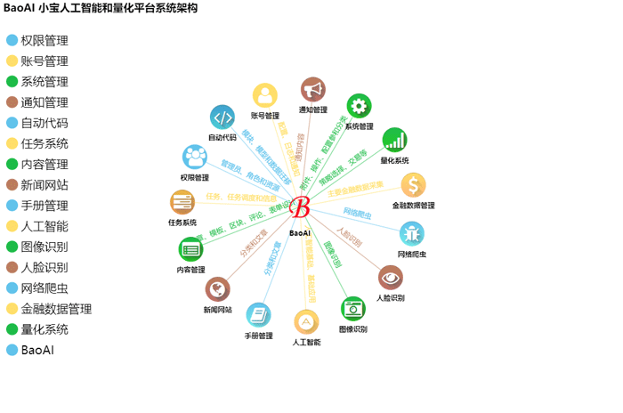
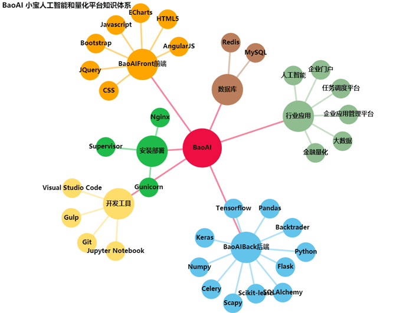
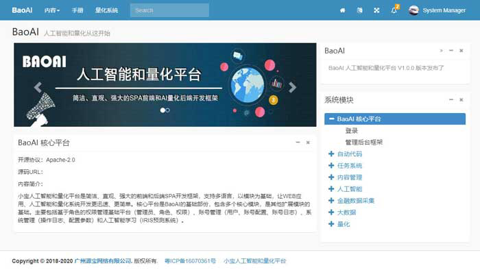
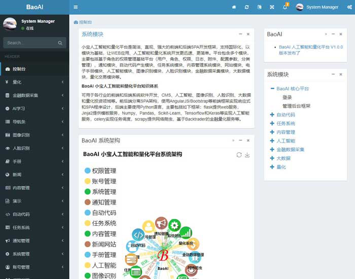
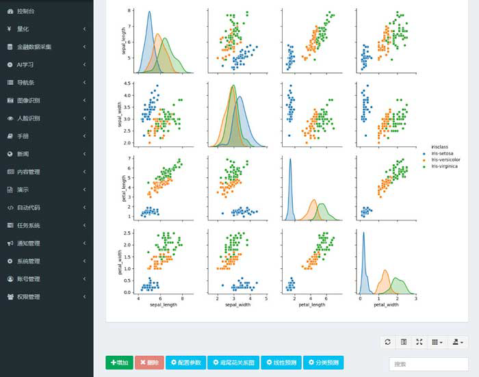
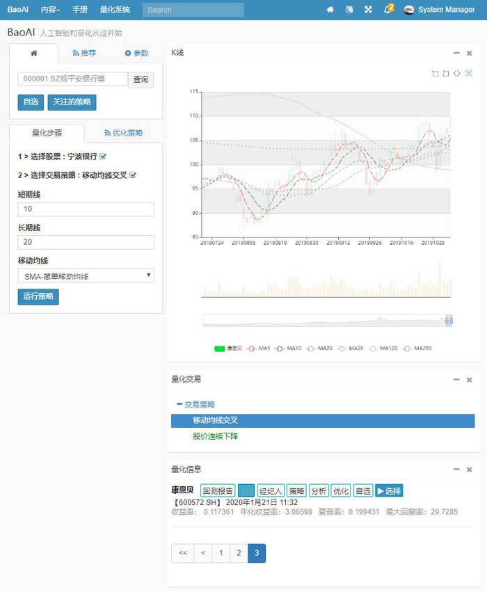
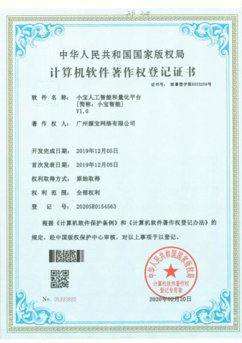

# Baoai Xiaobao artificial intelligence and quantitative system
Bao Artificial intelligence and quant start here

<p align="center">
<a href="http://www.baoai.co/" target="_blank">
    
</a>
<br>
<br>
    
    
    
    
    
    
    
</p>

Bao AI and quan platform is a simple, intuitive and powerful front-end and back-end SPA development framework. It supports internationalization, and based on modules, makes the development of web applications, AI and quantification system faster and simpler. The platform includes several modules, mainly including role-based rights management basic platform (user, role, rights, log, attachment, configuration parameter, classification management), notification module, automatic code generation module, task system module, content management system module, website module, electronic manual module, artificial intelligence module, image recognition module, face recognition module, Financial data collection module, big data module, quantitative transaction module, etc.


## Functional features:


+ Over 100000 lines of code

+ Modular platform, easy to develop and extend

+ Front end compatible with multiple browsers

+ Good compatibility, responsive design

+ Low learning curve of platform secondary development, easy to use

+ internationalization

+ Front and back code separation

+ H5 based single page application (SPA)

+ Automatic code generator

+ Automatically generate API documents and test interface

+ Support multi database and data migration

+ Powerful rich text editing

+ Artificial intelligence

+ Data crawler

+ Financial data collection module

+ Quantitative analysis

+ Perfect development and deployment tools and Solutions


## Download source code

Baoai front and back end separate frame structure, including front-end items and back-end items

+ Source code of front-end project: [baoaifront] (https://gitee.com/yunbaonet/baoaifront)


+ Source code of backend project: [baoaiback] (https://gitee.com/yunbaonet/baoaiback)

## Document
+ Manual

  + [baoai development manual] (README.md)

    - [feature.md] (feature.md)

    - [frame selection] (select.md)

    - [development tools] (tools.md)

    - [installation steps] (install.md)

    - [deployment] (deploy.md)

+ [baoai development manual] (http://www.baoai.co/web/book?id=50) http://www.baoai.co/web/book?id=50

+ [baoai backend development manual] (http://www.baoai.co/web/book?id=48) http://www.baoai.co/web/book?id=48

+ API

  + After running the backend project in development mode, it can be loaded, such as http://localhost:8000/api, and use swagger UI to load.


+ Module expansion

  + [module extension] (http://www.baoai.co/web/book?id=88)


## Front end and back end development tools

[Visual Studio Code](http://code.visualstudio.com)

Install plug-ins：

`Chinese (Simplified) Language Pack for Visual Studio Code`

`jshint`

`Python`


## Project front end  BaoAIFront installation steps

Need to install [Node.js](https://nodejs.org) 

```shell
# bower:
npm install -g bower

# gulp
npm install -g gulp

# Install third-party JS
bower install

# Install dependency Library:
npm install

# Mode 1 of running front-end code: built in data simulation API, suitable for front-end engineers
gulp server

# Mode 2 of running front-end code: Python full stack Development Engineer
gulp serve

# Mode 3 of running front-end code: Python full stack development engineer, reverse agent (front and back end share the same address and port, only directory is different)
gulp proxy

# Build production code
gulp build

# Mode 4 of running front-end code: test run production code
gulp prod

```
The production code is saved in the `dist` directory

## Project backend : BaoAIBack Installation steps

Need: [Python 3.6](http://www.python.org) 

```shell
# 1. Create a virtual environment
# windows, 假设项目根路径：d:/baoai/BaoaiBack/
cd d:/baoai/BaoaiBack
mkdir venv
cd venv
python -m venv .

# run virtual environment
d:/baoai/BaoaiBack/venv/Scripts/activate.bat
cd d:/baoai/BaoaiBack

# linux, 假设项目根路径：/baoai/BaoaiBack/
cd /baoai/BaoaiBack
mkdir venv
cd venv
python -m venv .

# run virtual environment
source /baoai/BaoaiBack/venv/bin/activate
cd /baoai/BaoaiBack

# 2. Install dependent libraries (must be in a virtual environment)
# windows Install dependent libraries
python -m pip install --upgrade pip
pip install -r requirements.txt
# Domestic image can be used if the download speed is slow
pip install -i https://pypi.tuna.tsinghua.edu.cn/simple -r requirements.txt

# linux Install dependent libraries
python -m pip3 install --upgrade pip
pip3 install -r requirements.txt
# Domestic image can be used if the download speed is slow
pip3 install -i https://pypi.tuna.tsinghua.edu.cn/simple -r requirements.txt

# 3. run Restful service
# windows
run_baoai.bat

# linux
# gunicorn wsgi
chmod +x run_baoai.sh
./run_baoai.sh

# 4. run www service(Jinja template)
# windows
run_www.bat

# linux
chmod +x run_www.sh
./run_www.sh

# Common functions
# Clear cache
python manage.py clean


```
## Project backend database

This project supports most popular relational databases, including SQLite, mysql, Postgres, Oracle, MS-SQL, sqlserver and Firebird.

SQLite database and MySQL data script file have been provided. MySQL supports version 5.5 and above.

There is no need to modify the code for database conversion, only the Sqlalchemy database URI in config.py can be modified.

By default, SQLite database is used. The advantage is that there is no need to install special database software, which is convenient for testing and development. For production deployment, please use MySQL or other database software.

SQLite data is saved in 'dB / baoai. Db', which can be used directly.

The MySQL database script is saved in 'dB / baoai. Mysql. SQL'. You need to create a new database such as baoai, and then import the script.

If you use other databases, you can use "data transfer" in the "Navicat premium" tool menu to migrate data before different databases.

Database related operations:

` ` ` `

# Data migration services
# Initialization
python manage.py db init

# model migrate
python manage.py db migrate

# database script upgrade
python manage.py db upgrade
```

## roject code auto generation module

With the automatic code generation module, fields, models, generated databases, front-end code, back-end code and permission configuration can be visualized together, and general projects can be implemented with zero code.
This part mainly includes three extension modules: data migration module, automatic code model module and automatic code generation module

## BaoAI platform system architecture



## BaoAI Knowledge system

It can be used in front-end and back-end system software development, CMS, artificial intelligence, image recognition, face recognition, big data and quantitative investment fields. The front-end and back-end separate the spa architecture, and use the front-end framework such as angularjs / bootstrap to realize responsive and Spa programming. The back-end mainly uses Python language, mainly including the following frameworks: Flask provides Web services, jinja2 provides template services, numpy, pandas, scikit learn, tensorflow and keras to realize artificial intelligence services, cellery implements task scheduling, and scraper provides web crawlers, Financial quantitative services based on backtrader.



Design case based on baoai：

Content management website：



Management system background：



AI：



Quant：



## Helo

+ Email [703264459@qq.com](703264459@qq.com) 

## License

Apache2.0

## Copyright


  


